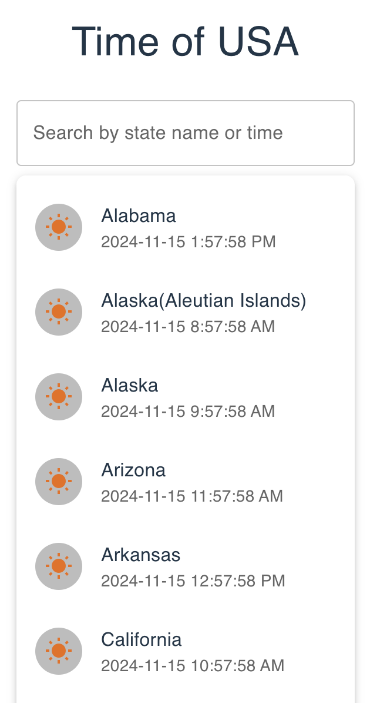

# Time of USA States - Chrome Extension

Time of USA States is a simple and elegant Chrome extension that displays the current time for various states in the USA. It comes with a search feature, allowing users to filter states by name or time. The app dynamically updates the time every second and provides a sun or moon icon depending on whether it's daytime or nighttime.
All the state time is calculated from Pakistani time.

---

## Features
- 🕒 **Real-Time Clock:** Displays the current time for each state.
- 🔍 **Search Functionality:** Filter states by name or time.
- 🌞/🌜 **Day/Night Indicators:** Sun icon for daytime and moon icon for nighttime.
- 📱 **Responsive Design:** Optimized for different screen sizes.

---

## Screenshot



---

## How to Install
1. Clone or download this repository:
   ```bash
   git clone https://github.com/your-username/time-of-usa-states.git
   ```
2. Navigate to the project directory and install dependencies:
   ```bash
   npm install
   ```
3. Build the project for production:
   ```bash
   npm run build
   ```
4. Navigate to the dist folder and add the manifest.json file (if not already present).

## Load the Extension in Chrome
1. Open Chrome and go to chrome://extensions.
2. Enable Developer Mode (top-right corner).
3. Click Load unpacked and select the dist folder.

## How to Use
1. Click on the extension icon in your browser toolbar.
2. Search for a state by its name or current time.
3. View the real-time clock for the state and check whether it's day or night.

## Project Structure
```bash
src/
├── App.jsx        # Main React component
├── Constant.js    # Contains state data
├── index.html     # HTML entry point
├── styles.css     # CSS for styling
public/
├── manifest.json  # Chrome extension manifest file
├── 16x16.png      # 16x16 extension icon
├── 32x32.png      # 32x32 extension icon
├── 48x48.png      # 48x48 extension icon
├── 128x128.png    # 128x128 extension icon
```
## Technology Stack
- React: UI framework
- Vite: Fast build tool
- [Material-UI](https://mui.com/): UI components for React
- [Moment.js](https://momentjs.com/): Time management library

## License
This project is licensed under the MIT License. Feel free to use and modify it as per your needs.

## Contributing
Contributions are welcome! Please fork this repository and submit a pull request with your enhancements or fixes.

## Acknowledgements
Special thanks to:

- Moment.js for date and time formatting.
- Material-UI for providing sleek UI components.

## Author
Developed with ❤️ by Syed Arbab Ali Shah.


Let me know if you need further assistance! 🚀


